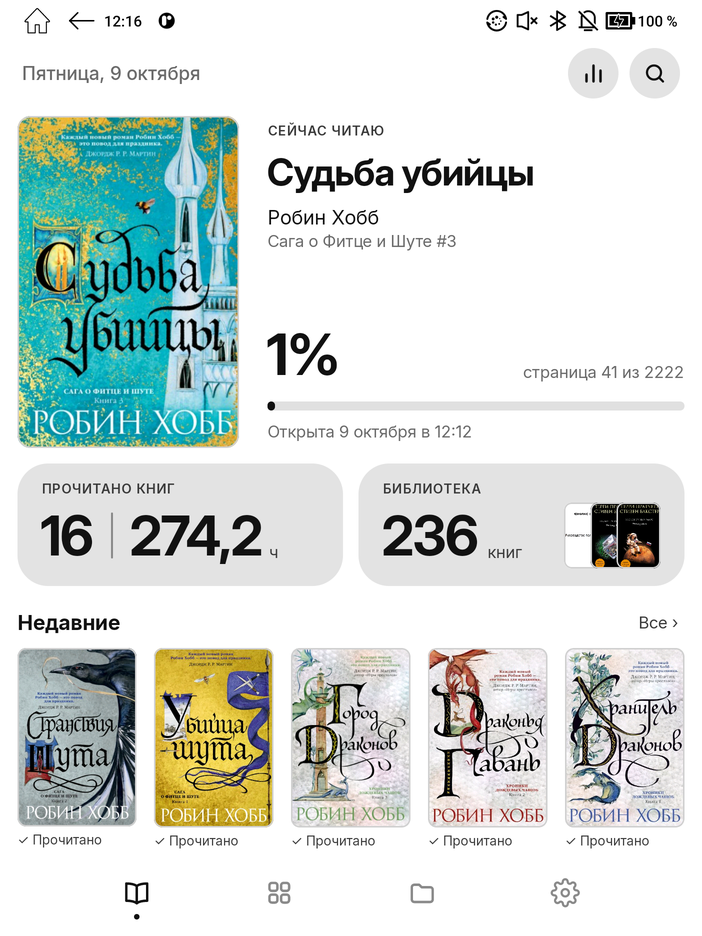
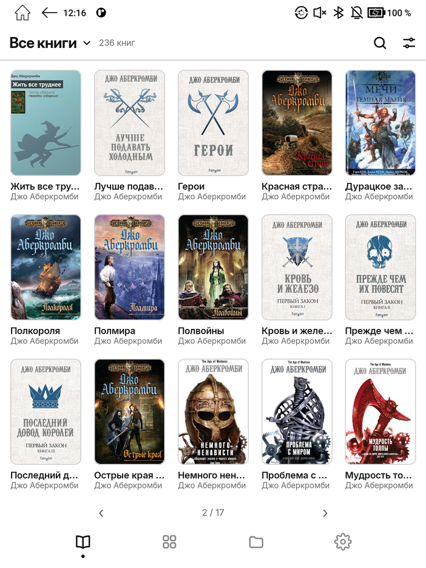
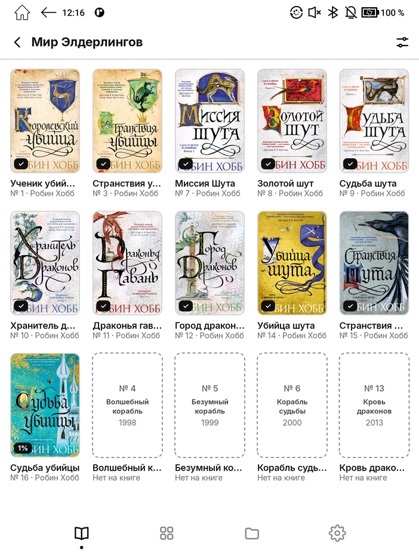
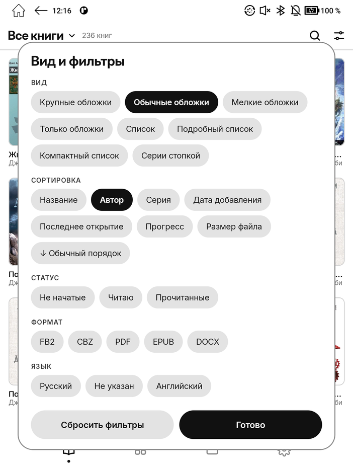
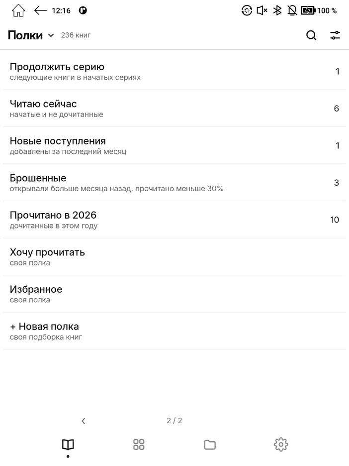
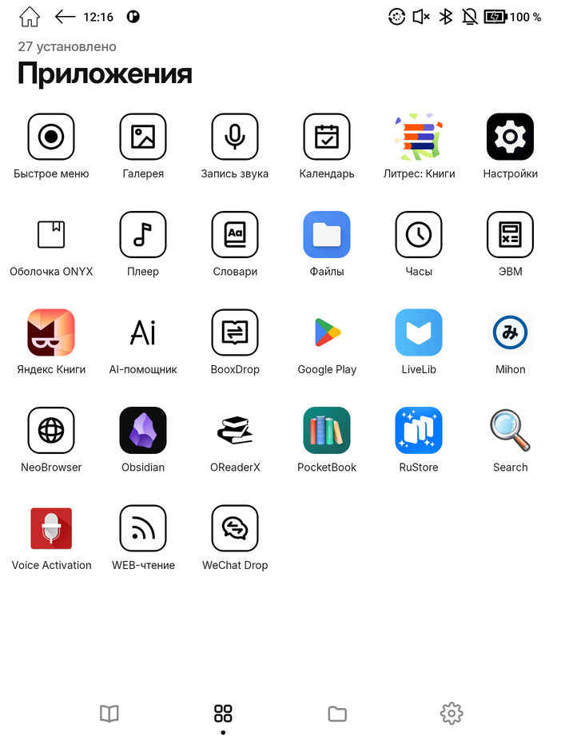
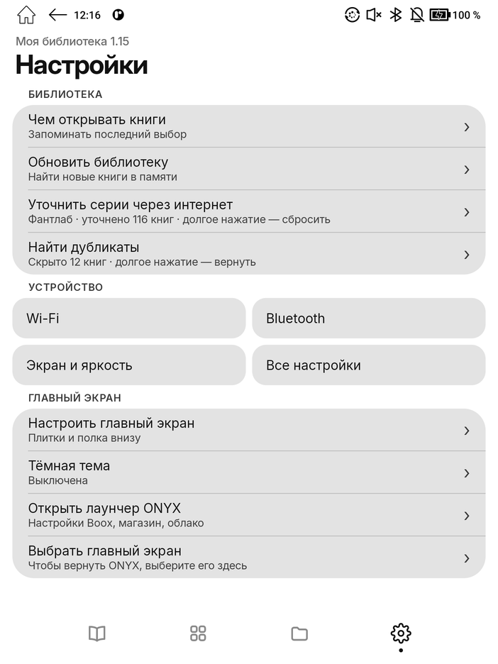

# Onyx Shelf Launcher

[English](README.md) · **Русский**

Минималистичный главный экран и библиотека в духе iOS для электронных книг **ONYX BOOX**. Сделан под медленное обновление E Ink: без прокрутки и анимаций, страницы листаются свайпом.

Сделан и проверен на **BOOX Kon‑Tiki 5** (Android 11). Должен работать и на других BOOX с Android 11 и новее.

<p align="center">
  
  
  
</p>

## Возможности

**Главный экран**
- «Сейчас читаю»: большая обложка, процент, текущая страница и время последнего открытия. Данные берутся из базы чтения BOOX, поэтому совпадают со штатными читалками.
- Настраиваемые плитки (два ряда по две): прочитано книг и общее время чтения, размер библиотеки, время чтения сегодня и за неделю, прочитано в этом году, «Читаю сейчас», «Хочу прочитать», «Продолжить серию».
- Полка внизу: недавние, продолжить серию, хочу прочитать, новые поступления или ничего.
- Кнопка, открывающая экран статистики чтения ONYX.

**Библиотека**
- Находит книги по всей памяти: FB2, FB2.ZIP, EPUB, PDF, DJVU, MOBI, AZW3, CBZ, DOCX, TXT и другие.
- Берёт из файлов название, авторов, серии (включая вложенные) с номерами, жанры, аннотацию и обложку, а также данные из `metadata.calibre` от Calibre.
- Семь видов: крупные обложки (3×2), обычные (5×3), мелкие (6×4), только обложки, список, подробный список, компактный список. Обложки всегда в пропорции 2:3.
- Сортировка по названию, автору, серии, дате добавления, последнему открытию, прогрессу и размеру файла, в прямом и обратном порядке.
- Фильтры по статусу чтения, формату и языку.
- Разделы: все книги, авторы, серии, жанры, недавние, полки. Серии можно собрать в стопки.
- Полки: автоматические («Продолжить серию», «Читаю сейчас», «Новые поступления», «Брошенные», «Прочитано в этом году») и свои.
- Поиск по названию, автору и серии.

**Карточка книги** (долгое нажатие на книгу)
- Аннотация, серии, жанры, формат, прогресс и сколько времени вы её читаете.
- «Читать», «Открыть в…», положить на полку, сменить обложку, убрать из недавних.
- Запоминает, каким приложением вы открывали книги каждого формата, и не спрашивает каждый раз.

**Серии и обложки (по желанию, нужен Wi‑Fi)**
- «Уточнить серии через интернет» сверяет книги с [Фантлабом]: исправляет циклы и номера и показывает, каких книг серии **нет на устройстве**.
- Свои обложки из памяти устройства или из интернета (обложки всех изданий с Фантлаба и Open Library).
- Сеть используется только по нажатию этих кнопок.

**Ещё**
- Сетка приложений, файлы, настройки — в том же стиле.
- Светлая и тёмная тема (обложки никогда не инвертируются).
- Поиск дубликатов: лишние копии одной книги можно скрыть, файлы при этом не удаляются.
- Бережёт батарею: в простое ни одной перерисовки и ~0% процессора, никакой фоновой работы и таймеров.

<p align="center">
  
  
  
</p>
<p align="center">
  
  
  
</p>

## Установка

1. Скачайте `onyx-shelf-launcher.apk` из [последнего релиза](../../releases/latest).
2. Перенесите файл на книгу (кабелем, через BooxDrop или облако) и откройте его в разделе **Память**, чтобы установить. Если система спросит, разрешите установку из неизвестных источников.
   С компьютера можно так: `adb install onyx-shelf-launcher.apk`
3. Откройте **Моя библиотека** и выдайте доступ **ко всем файлам**: без него приложение не найдёт книги в памяти.

### Сделать главным экраном

В лаунчере ONYX список библиотек жёстко зашит в прошивку, добавить туда стороннюю библиотеку нельзя. Поэтому приложение заменяет главный экран целиком:

- **На книге:** настройки Android → Приложения → Приложения по умолчанию → **Главный экран** → «Моя библиотека». На некоторых прошивках туда удобнее попасть из самого приложения: Настройки → «Выбрать главный экран».
- **Через adb:** `adb shell cmd package set-home-activity ru.efimov.booklib/.MainActivity`

**Вернуть ONYX:** Настройки → «Выбрать главный экран» → «Оболочка ONYX». Функции ONYX (магазин, облако, настройки E Ink) всегда доступны через Настройки → «Открыть лаунчер ONYX».

> Обновление прошивки BOOX может вернуть главным экраном лаунчер ONYX. Тогда просто выберите «Мою библиотеку» снова.

## Как пользоваться

- **Свайп** влево или вверх — следующая страница, вправо или вниз — предыдущая. Можно и нажимать на стрелки рядом с номером страницы.
- **Нажатие** на книгу открывает её, **долгое нажатие** показывает карточку.
- Первая страница библиотеки — это главный экран, один свайп ведёт ко всем книгам.
- Заголовок в шапке («Все книги ▾») переключает разделы: все книги, авторы, серии, жанры, недавние, полки.
- Кнопка с ползунками открывает вид, сортировку и фильтры.
- Новые книги появляются после перезапуска или по кнопке Настройки → «Обновить библиотеку». Фонового слежения за файлами нет, чтобы не тратить батарею.

## Сборка из исходников

Нужны JDK 17+ и Android SDK (platform 35).

```bash
git clone https://github.com/ysagisan/onyxboox_custom_launcher-.git
cd onyxboox_custom_launcher-
echo "sdk.dir=$HOME/Library/Android/sdk" > local.properties   # путь к вашему Android SDK
./gradlew assembleRelease
adb install -r app/build/outputs/apk/release/app-release.apk
```

Релизная сборка подписана отладочным ключом — для установки вручную этого достаточно.

## Как это устроено

- Kotlin и Jetpack Compose. Одна активность, которая заодно регистрируется как главный экран (HOME).
- Прогресс и статистика чтения берутся из провайдеров данных BOOX (`com.onyx.content.database.ContentProvider`, `com.onyx.kreader.statistics.provider`) теми же запросами, что использует экран статистики ONYX.
- Книги открываются в выбранной читалке по `file://`-ссылке, поэтому штатные читалки сохраняют позицию чтения.
- Интерфейс листается страницами, а не прокручивается: любой список нарезается на страницы ровно по размеру экрана.

## Благодарности

- Шрифт [Inter](https://rsms.me/inter/) (Расмус Андерссон), лицензия SIL Open Font License 1.1 (`licenses/Inter-OFL.txt`). San Francisco не используется: лицензия Apple запрещает его вне устройств Apple.
- Данные о сериях и обложки русских изданий — [Фантлаб](https://fantlab.ru), остальные обложки — [Open Library](https://openlibrary.org).

Проект не связан с ONYX International. BOOX и ONYX — товарные знаки их владельцев.

[Фантлабом]: https://fantlab.ru
